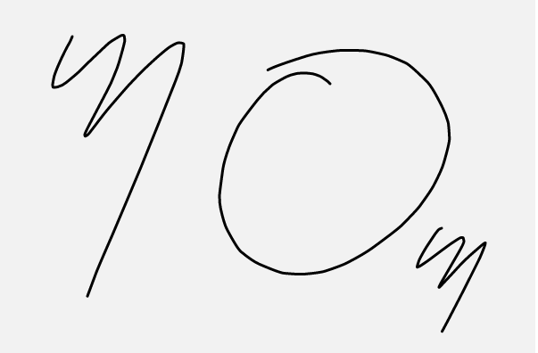

# Xoos.js
JS-based SVG drawing framework

## Features

    • Smooth lines
    • Realtime Eraser
    • Multiple Brushes
    • Layers support

## Example



## Usage

``` html

    <!-- Create your scene Div container -->
    <div id="samba"></div>
    
    <!-- Include the magic of xoos  -->
    <script src="dist/xoos.js"></script>

    <!-- And do the stuffs below  -->
    <script>

        // Create your xoos scene instance (Referencing your div ID : "samba")
        var myScene = new Xoos.scene("samba", 600, 400);

        // Create a layer and Add it to your scene
        var layer1 = new Xoos.layer();
        myScene.add(layer1);

        // And ignite the magic : That's All !
        myScene.draw();

    </script>

```
